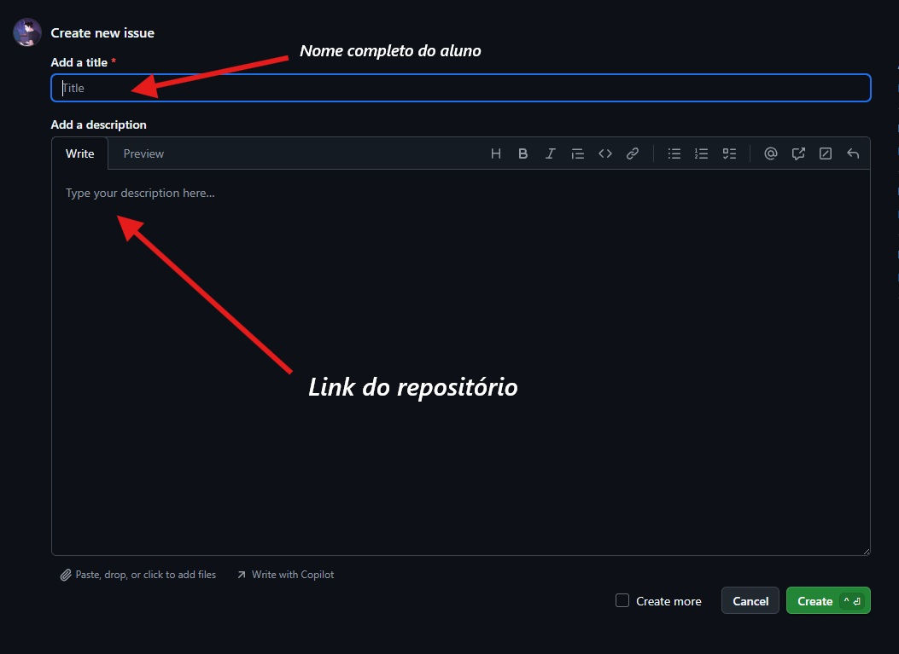

# 🚀 Projeto Front-End – Consumo de API com JavaScript

Este projeto faz parte da disciplina de **Programação de Sítios Internet** - FATEC.

## 🎯 Objetivo

Você deve criar uma aplicação web utilizando **JavaScript puro (Vanilla JS)** para consumir dados de uma **API pública**, exibindo os resultados de forma dinâmica em uma interface amigável.

## 💡 O que você deve implementar

- Crie um **campo de busca** para o usuário digitar o termo desejado
- Consuma uma **API pública** utilizando `fetch()`
- Exiba os resultados da busca em formato de **cards criados dinamicamente**
- Utilize **métodos de manipulação do DOM** para criar os elementos HTML
- Implemente **tratamento de erros** no campo de busca (ex: campo vazio, resultado não encontrado)
- Garanta que a interface esteja **responsiva**

## 🌐 Sugestão de APIs públicas

- 🦸 **SuperHero API** – [https://superheroapi.com](https://superheroapi.com)
- 🎬 **OMDb API** (filmes) – [https://www.omdbapi.com](https://www.omdbapi.com)
- 🖼️ **Pixabay API** (imagens) – [https://pixabay.com/api/docs](https://pixabay.com/api/docs)

## 📦 Entrega

### Como entregar

Você deve criar uma **issue** neste repositório com as informações do seu projeto, seguindo o modelo abaixo:

### Prazos

| Data | Condição |
|------|----------|
| **17/04/2026** | Entrega em sala de aula — o professor poderá verificar e orientar correções |
| **22/04/2026** | Entrega somente pela issue — sem verificação prévia |

> ⚠️ Após o prazo final (22/04), nenhuma entrega será aceita.

### README do seu projeto

Utilize o [modelo de README](./readmeAluno.md) como base para documentar o seu repositório.

## ✅ Critérios de Avaliação
* [ ] Você criou o campo de busca? (0,5)
* [ ] Os cards são criados dinamicamente? (1,5)
* [ ] Os cards são criados dependendo da busca? (1,5)
* [ ] Você utilizou métodos para criar os novos elementos HTML? (1,5)
* [ ] O consumo de API foi feito usando o `fetch()`? (1,5)
* [ ] Você incluiu tratamento de erro no campo de busca? (0,5)
* [ ] Está responsivo? (1,0)
* [ ] Você criou o README com informações do projeto? (1,0)
* [ ] Você habilitou o GitHub Pages? (0,5)
* [ ] Você publicou no LinkedIn? (0,5)

## 👨‍🏫 Disciplina

**Programação de Sítios Internet**  
Prof. Fernando Leonid – 2026

---
